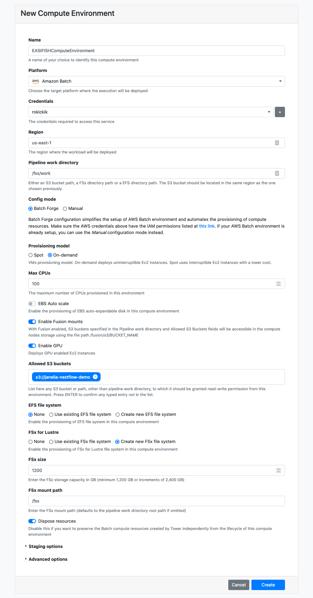
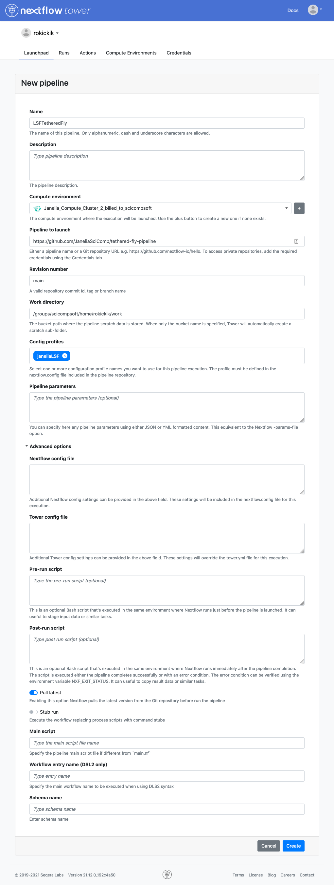

# Running on AWS using Nextflow Tower

A public demonstration version of Tower is available at [tower.nf](https://tower.nf) and can be used to execute the pipeline on any cloud provider.

The first time you log in, your account request will need to be approved manually by the Nextflow team. Once you get an email about your account being activated, you'll be able to log in again and run the pipeline.

## Creating a Compute Environment

You will first need to create a compute environment in Tower to describe your compute resources. Use the "Tower Forge" method to automatically create the required resources. The official documentation provides [detailed instructions](https://help.tower.nf/compute-envs/aws-batch/#forge-aws-resources) to set this up. As part of this process, make sure to create an S3 Bucket for your data.

Here are some hints for the values that we found works for this pipeline:



To create the AMI for AWS follow [these instructions](CreateBaseComputeAMI.md)

## Adding the pipeline

Once you have a compute environment (with Status "AVAILABLE"), you can add the pipeline to it. In the *Launchpad* tab, click **New pipeline** and fill in these values (using the compute environment you just created):



## Uploading your data

Before launching the pipeline, make sure all of your data has been uploaded to your AWS S3 Bucket. You can use a graphical program such as [Cyberduck](https://cyberduck.io/), or if you are comfortable with the command line terminal, you can use the [AWS Command Line Interface](https://aws.amazon.com/cli/) to manage your bucket. Once it is configured, you can upload a file to an S3 bucket by using a command like this:

```bash
aws s3 cp /path/to/fly2BodyAxis_lookupTable.csv s3://janelia-nextflow-demo/huston/
```

Here, `janelia-nextflow-demo` is the name of the S3 Bucket, and huston is the name of the folder inside the bucket.

To upload a folder, use the `--recursive` option:

```bash
aws s3 cp --recursive /path/to/my/apt_cache s3://janelia-nextflow-demo/huston/apt_cache
```

## Launching the pipeline

When you click on the pipeline in the Launchpad, you will see all of the parameters laid out in a web GUI. Fill in the parameters to point to your files on S3. Note that your S3 bucket will be mounted at `/fusion/s3/<bucket-name>`. For example, if you folder was uploaded to `s3://janelia-nextflow-demo/huston/apt_cache` then the  parameter value should be `/fusion/s3/janelia-nextflow-demo/huston/apt_cache`.

Finally, click the Launch button and monitor your pipeline's execution.
