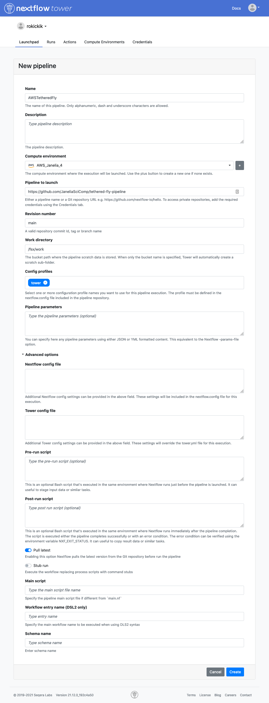

# Running on the LSF Cluster at Janelia using Nextflow Tower

This option requires access to the internal Janelia network.

If you are not using Janelia's internal network, you can use the [AWS option](NextflowTowerAWS.md) or ask your system administrator to purchase and install Nextflow Tower at your institute.

Janelia has an internal Nextflow Tower installation which can be used to run Nextflow pipelines on the Janelia Compute Cluster. For Janelia users, this option is the most convenient and cost effective way to run the EASI-FISH computational pipeline.

## Getting Started

To get started, submit a help desk ticket to request access to the [Janelia Compute Cluster](https://wiki.int.janelia.org/wiki/display/ScientificComputing/Janelia+Compute+Cluster).

Next, you will need to generate an SSH key pair on the cluster. Open a terminal and run the following command (you can skip this step if you are using NoMachine):

```bash
ssh login1.int.janelia.org
```

Type `yes` if prompted and enter your password when asked. Then, run the following command to generate an SSH key pair:

```bash
ssh-keygen -t rsa -b 4096 -C "your_email@example.com"
```

There will be several prompts and you should just hit enter to accept the default value for each one. You can choose to enter a passphrase for more security. Keep track of the passphrase and the path to the generated key file which will look something like `/home/<USER>/.ssh/id_rsa`. More detailed information about generating SSH keys can be found [here](https://docs.github.com/en/authentication/connecting-to-github-with-ssh/generating-a-new-ssh-key-and-adding-it-to-the-ssh-agent).

Next, [install Nextflow](https://www.nextflow.io/docs/latest/getstarted.html) by downloading it and adding it to your path. Type these commands into your terminal, one at a time:

```bash
cd $HOME
mkdir -p bin
curl -s https://get.nextflow.io | bash
mv nextflow bin/ 
echo 'export PATH=$PATH:/$HOME/bin' >> .bashrc
```

Next, make sure that the LSF profile is configured to run when you log into your account:

```bash
echo '. /misc/lsf/conf/profile.lsf' >> .bashrc
```

Now you can login to the [Janelia Internal Nextflow Tower](http://nextflow.int.janelia.org).

## Creating a Compute Environment

You will first need to create a compute environment in Tower to describe your LSF cluster access. You can do this by clicking on the "Compute Environments" tab and then selecting "New Environment". Give your environment a name, and choose "IBM LSF" as the Platform. Next, click on the plus sign (+) next to the Credentials section. Enter the path to your SSH private key file and your passphrase (if you chose to enter one above) and click "Create".

Fill in the rest of the fields as follows, making sure to select the "per job mem limit" option:


## Adding the Pipeline

In the *Launchpad* tab, click **New pipeline** and fill in these values:



## Launching the Pipeline

When you click on the pipeline in the Launchpad, you will see all of the parameters laid out in a web GUI. Click "Upload params file" and select one of the JSON files in the examples directory, for example `demo_tiny.json`. This will populate the parameters with the values needed to run the pipeline to process the `demo_tiny` data set.

Fill in the `shared_work_dir` to point to your fsx mount (e.g. /fsx/pipeline) and `publish_dir` to point to your mounted S3 bucket (/fusion/s3/bucket-name). Now click the Launch button. This will begin by downloading data in the data_manifest, and then running the complete analysis pipeline.

### Processing your data

There are two ways to get your data into the pipeline. If your data is available via HTTP (e.g. on Figshare or similar file sharing service) then you can create a data manifest and the pipeline will download the data before running. Look under the `data-sets` directory for examples of how to set this up.

Alternatively, you can upload the data to your S3 bucket, and then set the `data_dir` parameter to point to it. You'll need to click on "Show hidden params" to show this parameter in the web GUI. Also, you should add your S3 bucket to the "Allowed S3 buckets" field on your Compute Environment. The easiest way to do this is to go to the "Compute Environments" tab and click the "Clone" button to make a copy of your environment. Then you can add the S3 bucket to the "Allowed S3 buckets" field on the new environment.
